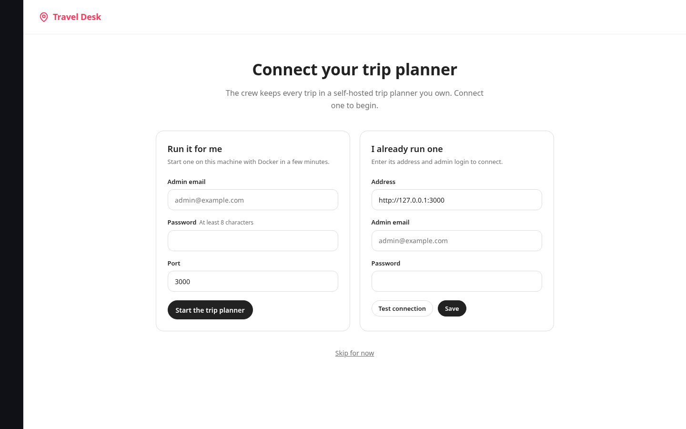
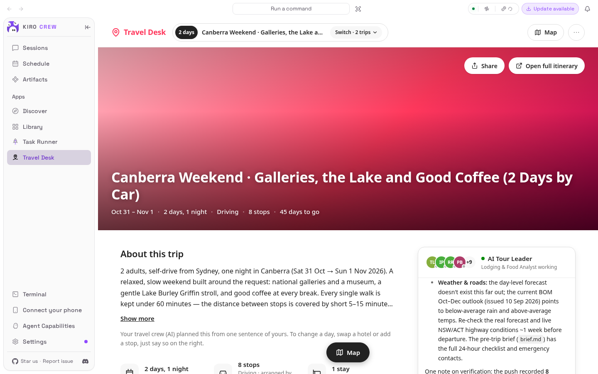
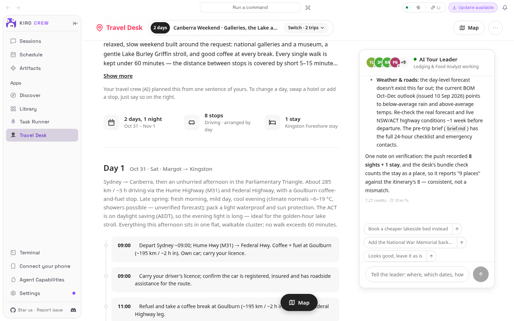
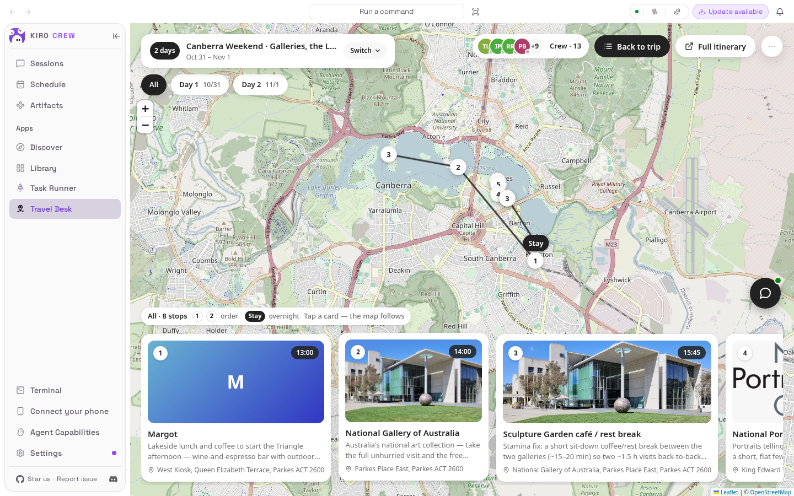
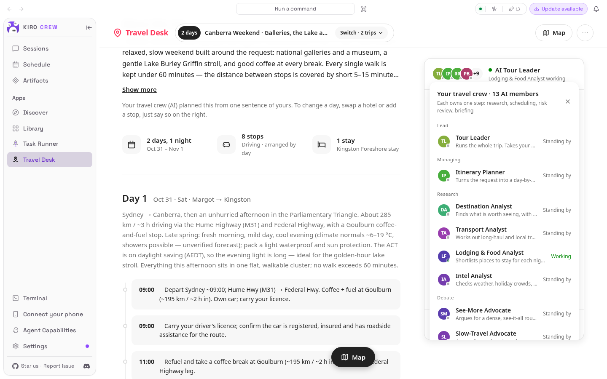
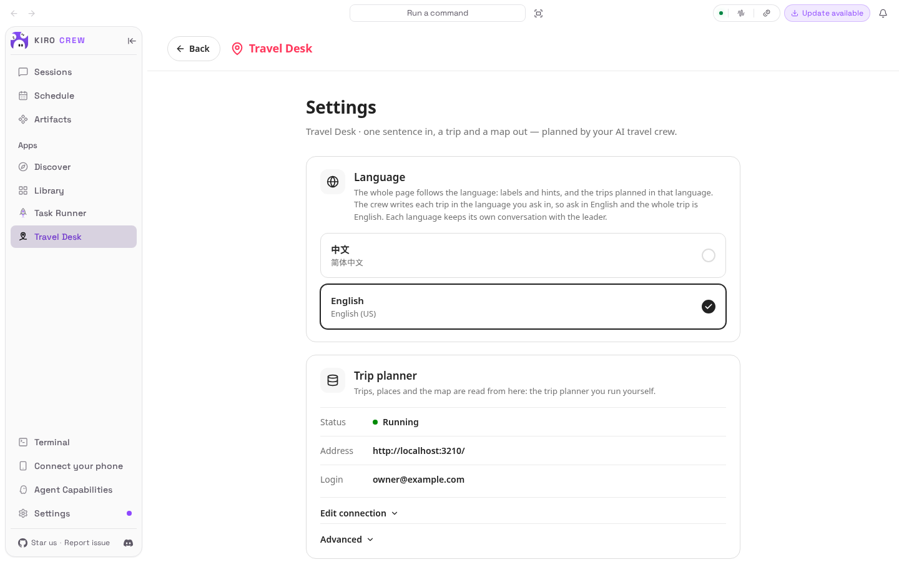
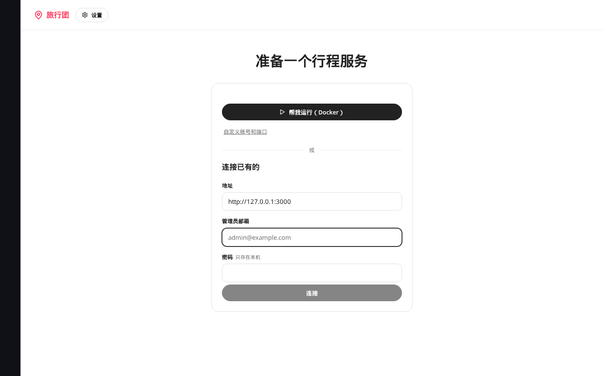
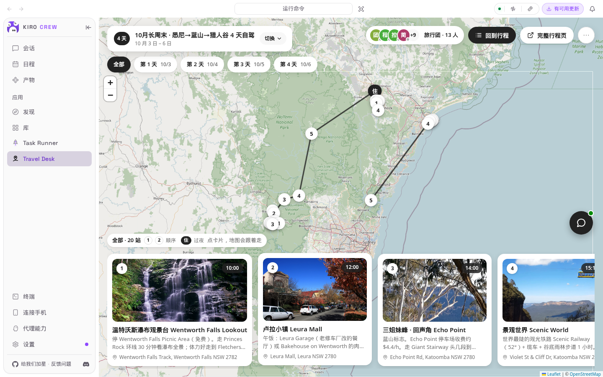

# Travel Desk

Travel Desk is a KiroCrew app. A crew of 13 AI agents turns one sentence into a
researched, debated and risk-checked day-by-day trip. The result is shown on a
photo-rich trip page and map inside the dashboard, and stored in your own
self-hosted trip planner ([TREK](https://github.com/liketrek/TREK)) so the data
stays on your machine and remains editable outside this app.

## How a trip is made

You give the Tour Leader one sentence. From there:

1. Request. The leader turns your sentence into a request the crew can work from.
2. Planning. The Itinerary Planner runs four analysts in parallel (destination,
   transport, lodging and food, intel), then chairs a two-round debate between a
   see-more advocate and a slow-travel advocate, writes a verdict on the pace,
   and produces a day-by-day itinerary with real coordinates.
3. Risk review. Three officers (budget, safety, stamina) review the itinerary
   and return PASS or REVISE. On REVISE the planner applies exactly one revision
   round.
4. Publish. The finished itinerary is pushed into your trip planner.
5. Briefing. A pre-trip briefing produces the one-page checklist for the day
   before departure.

## Requirements

- KiroCrew 0.8 or newer.
- A trip planner. Either let the app run one for you with Docker, or point it at
  a TREK instance you already run.
- Python 3.10 or newer.
- Optional: `npx`, used by the Airbnb research tool when available.

## Install

From the App Store once listed, or by hand:

```
git clone https://github.com/chenmingwei23/kiro-crew-travel-desk
kirocrew app install kiro-crew-travel-desk
kirocrew restart
```

`kirocrew app install` takes the local directory that contains `app.json`.

This app ships a Python backend and 13 agents, so KiroCrew asks you to trust it
before any of that code runs (third-party app code is off by default). Installing
from the App Store shows a Trust dialog; for a CLI install grant it yourself,
then enable the app and restart the gateway:

```
kirocrew config set agent.apps_trusted '["travel-desk"]'
kirocrew config set agent.apps_trusted_local '["travel-desk"]'
kirocrew app enable travel-desk
```

`config set` replaces the whole list. If `kirocrew config get agent.apps_trusted`
already names other apps, keep them in the list.

The crew's agents run unattended (a research analyst has nobody to click
Approve), so their specs auto-approve their own tools; KiroCrew's deny list and
sensitive-path checks still apply to every command they run.

## First run

Open Travel Desk in the sidebar. There is no login screen to get through. The
app connects to a trip planner on its own whenever it can, in this order:

- A login already saved in `<desk root>/trek.env`.
- A trip planner already running in Docker on this machine and publishing the
  configured port (`http://127.0.0.1:3000` by default). The app reads the admin
  login the container was started with, tests it, and saves it as if you had
  typed it. Nothing to enter.
- A login ticket the planner issued earlier (`<desk root>/.trek_token`), for as
  long as it is valid.

Only when none of those exist does a page appear, and the page is the action:

- A planner answers at the address but has no login here: a sign-in form
  (address, admin email, password) and one Connect button. The app tests the
  login before saving it.
- Nothing answers: Run it for me, one click. The app starts the trip planner
  in a Docker container bound to loopback, keeps its state under the desk root,
  and generates the admin login itself (`admin@travel-desk.local` plus a random
  password; "Custom login and port" if you want your own). Below it, the same
  sign-in form for a planner you run elsewhere.

The Settings page keeps the trip planner row: connection state, address, the
login and where it came from, and a form to change it.

User data lives at the desk root, by default `<gateway home>/workspace/travel-desk`:
trips, long-term memory, backups, and the container's own state when the app
runs it. The trip planner login is written to `<desk root>/trek.env` with file
mode 600 and is never returned by any route.

## Usage

Say one sentence to the Tour Leader: where, which dates, how many people,
driving or transit. The crew researches, schedules and risk-checks it, and the
trip and map appear on the page.

Examples:

- Oct 17–19, Great Ocean Road from Melbourne, 3 days by car, 2 people.
- 10 月 17 到 19 日，墨尔本大洋路 3 天自驾，2 个人。

The chat is a side card on the trip page. The corner button opens it as a
workbench: the conversation fills the page and the crew stands on the left --
the leader, then whoever is working on your trip; the rest fold into one
"standing by" line. Click any member to talk to them directly (the hotel
specialist about a hotel, the safety officer about a road); the arrow brings
you back to the leader, who is the one that changes the plan. Use the workbench
while a trip is being planned; shrink it back to read the plan. You can talk to the leader while the crew is still
working -- a side question is answered in passing, and the plan carries on. The
leader speaks about the trip on your screen, and speaks as a travel company
would: no file names, no ids, no verdicts.

The interface language switch is in Settings. It defaults to your browser
language: a browser reporting a Chinese locale opens in 中文, otherwise English.
The crew writes each trip in the language you asked in, so a request in English
produces an English trip. Each language keeps its own conversation with the
leader, and each language shows its own trips; switch the language to see the
trips planned in the other one.

## The team

| Member | Role | What they do |
|---|---|---|
| Tour Leader | Lead | Runs the whole trip. Takes your one-sentence request, arranges the planning, the risk review and the pre-trip briefing, follows through to completion, writes the result into the itinerary and hands you a short report with the decisions that need you. |
| Itinerary Planner | Managing | Turns the request into a day-by-day plan: runs four research tracks (destination, transport, lodging and food, intel), chairs the see-more vs slow-travel debate, sets the pace and produces the itinerary with real coordinates. |
| Risk Review | Risk | Reviews the plan for budget, safety and stamina. Merges the three risk officers' findings into must-fix items and reminders, and rules pass or revise. |
| Pre-trip Briefing | Briefing | A one-page checklist before departure: 24-hour to-dos, one line per day, weather and road conditions, booking checks, emergency contacts. Triggered by the leader or automatically the day before. |
| Destination Analyst | Research | Finds what is worth seeing, with suggested time, tickets, opening hours and a one-line reason, grouped by area, and says what to skip. Every item cites a source. |
| Transport Analyst | Research | Works out long-haul and local transport, drive-time tables, parking and fuel stops, with schedules and price sources. Road conditions per leg for self-drive trips. |
| Lodging & Food Analyst | Research | Shortlists places to stay for each night and restaurants by area, with prices, reasons and sources, and flags what must be booked ahead. |
| Intel Analyst | Research | Checks weather, holiday crowds, closures and roadworks, reputation highlights, and visa, ID and insurance requirements. Every item cites a source. |
| See-More Advocate | Debate | Argues for a dense, see-it-all route with a day plan, and rebuts the slow side point by point so the planner hears that case in full. |
| Slow-Travel Advocate | Debate | Argues for a relaxed, go-deep route with a day plan, and rebuts the see-more side point by point so the planner hears the other case. |
| Budget Officer | Risk | Reviews the plan on cost: flags over-budget or poor-value choices and offers savings and alternatives. |
| Safety Officer | Risk | Reviews the plan on safety: road, weather, activity and personal-safety risks, with the precautions and reminders to add. |
| Stamina Officer | Risk | Reviews the plan on pace and fatigue: which day is overpacked, which drive or hike is too much, and a better loose-tight rhythm. |

## Configuration

Per-machine settings live in `data/config.json` (written by the app, never
committed):

| Key | Meaning |
|---|---|
| `deskRoot` | Where user data lives. Default `<gateway home>/workspace/travel-desk`. |
| `trekUrl` | Address of the trip planner. Default `http://127.0.0.1:3000`. |
| `trekContainer` | Name of the app-managed Docker container. Default `travel-desk-trek`. |
| `trekImage` | Docker image for the app-managed planner. Default `mauriceboe/trek`. |
| `trekManaged` | True when the app runs the planner itself in Docker. |

Environment variables override the config: `TRAVEL_DESK_ROOT` (the desk root),
`TREK_URL` (the planner address), `TREK_ENV` (the path to `trek.env`).

All 13 agents are pinned to one model, `gpt-5.6-sol` (the `model` field of each
file in `agents/`). The gateway treats that field as your preference: editing
the installed copy under your Kiro agents directory survives an app refresh, and
`scripts/build_agents.py` sets it for the shipped files.

## What runs in the background

Nothing is scheduled. The app ships no crons. The backend makes network calls
only while you are using it, and only to:

- your own trip planner, for trips, places and the itinerary;
- Wikipedia, for place photos;
- Nominatim, for geocoding.

All outbound calls carry a `travel-desk` User-Agent.

## Troubleshooting

- The sign-in page shows up again later. The app has no login for the planner
  and its ticket expired (tickets last 24 hours). If the planner runs in Docker
  on this machine, the app picks the login up again by itself within a minute;
  otherwise sign in once on that page.
- The leader reports that `session_create` / `session_send` were refused with
  "the signed pid mapping for this session did not verify". Those tools need
  KiroCrew's identity channel, which the OS sandbox provides on Linux (user
  namespaces) and macOS (`sandbox-exec`). On a host without one, route the two
  host servers through KiroCrew's MCP broker and restart the gateway:
  `kirocrew config set mcp_gateway.enabled true` and
  `kirocrew config set mcp_gateway.stub_servers '["kirocrew-core","kirocrew-dashboard"]'`.
- Nothing happens after you send a sentence. Check that the app is trusted and
  enabled (`kirocrew app list`), and that `kirocrew doctor` reports Kiro CLI as
  signed in.

## Development

Run the tests and checks from the repository root:

```
python3 -m pytest tests -q      # with the kiro_crew package importable
node --check ui/*.mjs           # parse-check the UI modules
python3 scripts/build_agents.py --check   # agent specs match their prompt sources
```

There is a local dev harness that exercises the app without the live gateway:

```
python3 dev/harness.py
```

## Repository layout

```
app.json      the app manifest
backend/      in-process HTTP routes (aiohttp), served under /api/apps/travel-desk
engine/       standalone scripts the agents run (orchestrate, geocode, push_trip, trek_api, ...)
agents/       the 13 agent specs, built by scripts/build_agents.py from agents/prompts/
ui/           the ES-module React UI (createElement, no JSX, no bundler)
desk/         charter, contract, roster (members.json), templates, example itinerary
skills/       the travel-desk skill for the default assistant
scripts/      install and uninstall accelerators, and the agent-spec build
design/        the design brief and API notes
dev/          the local dev harness
tests/        the pytest suite
```

## Screenshots

Taken from a fresh install in an isolated KiroCrew gateway with its own
Docker-run trip planner; the Canberra trip was produced by the crew from one
sentence.

| | |
|---|---|
|  |  |
| Only when nothing connects on its own: one click runs a trip planner in Docker, or sign in to one you already run | The trip page: hero, facts, one block per day, the Tour Leader alongside |
|  |  |
| The crew's finished Canberra weekend with the leader's report in the chat | Full map view: numbered stops, overnight stays, photo cards per day |
|  |  |
| The 13-member crew and what each one does | Settings: language, the trip planner row (address, login and where it came from), advanced controls |

The same pages in 中文: [trip page](design/evidence/trip-page-zh.png),
[map](design/evidence/map-all-zh.png), [setup](design/evidence/setup-zh.png).

## License

This app is licensed under the MIT License; see `LICENSE`. The trip planner it
uses, TREK, is licensed under AGPL-3.0 and is used unmodified over its REST API.

---

# 旅行团（Travel Desk）

Travel Desk 是一个 KiroCrew app。一支 13 人的 AI 旅行团把你的一句话变成一份
经过研究、辩论和风控的逐日行程。结果显示在 dashboard 里一个图片丰富的行程页和
地图上，并存进你自己自托管的行程服务（[TREK](https://github.com/liketrek/TREK)），
数据留在你自己的机器上，也能在这个 app 之外继续编辑。

## 一趟行程是怎么做出来的

你对团长说一句话，接下来：

1. 需求。团长把你这句话整理成旅行团可以据此工作的需求。
2. 规划。行程师并行跑四路分析师（目的地、交通、食宿、情报），主持多看派和
   慢游派两轮辩论，就节奏写出裁决，产出一份带真实坐标的逐日行程。
3. 风控评审。预算、安全、体力三位风控官评审行程，给出通过（PASS）或需要修改
   （REVISE）。需要修改时，行程师只做一轮修订。
4. 发布。完成的行程被推进你的行程服务。
5. 简报。行前简报产出出发前一天的一页纸清单。

## 环境要求

- KiroCrew 0.8 或更新版本。
- 一个行程服务。可以让 app 用 Docker 帮你运行一个，也可以指向你已经在运行的
  TREK 实例。
- Python 3.10 或更新版本。
- 可选：`npx`，Airbnb 研究工具在可用时会用到。

## 安装

上架后从 App Store 安装，或手动安装：

```
git clone https://github.com/chenmingwei23/kiro-crew-travel-desk
kirocrew app install kiro-crew-travel-desk
kirocrew restart
```

`kirocrew app install` 接收包含 `app.json` 的本地目录。

这个 app 带有 Python 后端和 13 个 agent，所以 KiroCrew 会先请你信任它，代码才会运行
（第三方 app 的代码默认是关闭的）。从 App Store 安装会弹出信任对话框；用命令行安装则
需要自己授权，然后启用 app 并重启网关：

```
kirocrew config set agent.apps_trusted '["travel-desk"]'
kirocrew config set agent.apps_trusted_local '["travel-desk"]'
kirocrew app enable travel-desk
```

`config set` 会整个替换这个列表。如果 `kirocrew config get agent.apps_trusted` 里已经有
别的 app，把它们一并写进去。

团队里的 agent 是无人值守运行的（分析师背后没有人点"批准"），所以它们的规格文件对自己的
工具自动放行；KiroCrew 的命令黑名单和敏感路径检查仍然对它们的每条命令生效。

## 首次运行

在侧边栏打开 Travel Desk。没有登录页。app 能自己连上行程服务就自己连，顺序是：

- `<desk root>/trek.env` 里已经保存的登录。
- 本机 Docker 里已经在跑、并且发布了配置端口（默认 `http://127.0.0.1:3000`）的行程
  服务。app 读出容器启动时带的管理员登录，先测试，再像你手填的一样保存。一个字不用填。
- 行程服务之前发过的登录票据（`<desk root>/.trek_token`），在有效期内直接用。

三样都没有时才出现一页，而这一页本身就是动作：

- 地址上有行程服务在回应、但这里没有它的登录：一个登录表单（地址、管理员邮箱、密码）
  和一个"连接"按钮。app 先测试登录再保存。
- 什么都没回应：一键"帮我运行"。app 用 Docker 启动一个只绑定本机回环地址的行程服务容器，
  状态保存在 desk root 下，管理员账号由 app 自己生成（`admin@travel-desk.local` 加随机密码；
  想用自己的账号，点"自定义账号和端口"）。下面是同一个登录表单，给在别处运行的实例用。

设置页保留"行程服务"一行：连接状态、地址、登录和它从哪来，以及修改用的表单。

用户数据放在 desk root，默认是 `<gateway home>/workspace/travel-desk`：行程、
长期记忆、备份，以及 app 自己运行容器时容器的状态。行程服务的登录信息写在
`<desk root>/trek.env`，文件权限 600，任何接口都不会返回它。

## 使用

对团长说一句话：去哪、几号到几号、几个人、自驾还是公交。旅行团会查资料、
排日程、过风控，行程和地图就出现在这个页面上。

例子：

- 10 月 17 到 19 日，墨尔本大洋路 3 天自驾，2 个人。
- Oct 17–19, Great Ocean Road from Melbourne, 3 days by car, 2 people.

对话默认是行程页右侧的一张卡。卡角的按钮把它放大成工作台：对话铺满页面，
旅行团站在左边——团长，以及正在忙你这趟行程的成员；其余的人收成一行"待命"。
点任何一位成员就能直接和他聊（酒店问食宿分析师，路况问安全官），箭头回到团长，
改行程还是团长来。规划时用工作台，看行程时缩回去。
团队还在忙的时候也可以随时问团长，小问题顺手就答，规划不会中断。团长说的
是你屏幕上这趟行程，而且像旅行公司的人那样说话：没有文件名、编号和"通过/
不通过"。

界面语言开关在设置里。它默认跟随你的浏览器语言：浏览器报告中文区域时打开中文，
否则英文。旅行团按你提需求的语言写行程，所以用英文提需求，整趟就是英文。每种
语言各有一段和团长的对话，各自显示各自的行程；切换语言就能看到用另一种语言
规划的行程。

## 团队

| 成员 | 分工 | 职责 |
|---|---|---|
| 团长 | 指挥 | 统筹整趟行程。接到一句话需求后安排行程规划、风控评审和行前简报，跟进到全部完成，把结果写进行程里并汇总成一份简明汇报，附需要你拍板的事项。 |
| 行程师 | 管理 | 把需求做成一份逐日行程。组织目的地、交通、食宿、情报四路研究，主持多看与慢游两派辩论，裁定节奏，产出带真实坐标的逐日行程。 |
| 风控汇总 | 风控 | 审这趟行程的预算、安全和体力风险。汇总三位风控官的意见，去重合并出必改项和便签提醒，给出通过或需要修改的结论。 |
| 行前简报 | 简报 | 出发前给一页纸清单：24 小时待办、逐日一句话、天气路况、预订核对、紧急联络。可由团长手动触发，也会在出发前一天自动生成。 |
| 目的地分析师 | 分析 | 查目的地值得去的景点，给出建议时长、门票、开放时间和一句话理由，按区域分组，并说明哪些不推荐。每条都附来源。 |
| 交通分析师 | 分析 | 查大交通和当地交通方案，整理车程表、停车与加油点，给出时刻与价格来源。自驾行程标清每段路况。 |
| 食宿分析师 | 分析 | 按每晚位置查住宿候选，按区域查餐厅候选，给出价格、理由和来源，并列出需要提前预订的项。 |
| 情报分析师 | 分析 | 查天气、节假日人流、临时关闭施工预警、口碑要点，以及签证证件保险要求，每条都附来源。 |
| 多看派 | 辩论 | 主张紧凑多看的路线，给出逐日方案，并逐条反驳慢游派，让行程师在取舍时听到充分的一方。 |
| 慢游派 | 辩论 | 主张慢下来深度玩的路线，给出逐日方案，并逐条反驳多看派，让行程师在取舍时听到另一方。 |
| 预算官 | 风控 | 从花费角度审行程，指出超预算或不划算的安排，给出可以省的地方和替代方案。 |
| 安全官 | 风控 | 从安全角度审行程，指出路况、天气、体验项目和治安上的风险点，给出必要的防护和便签提醒。 |
| 体力官 | 风控 | 从体力和节奏角度审行程，指出哪天排得太满、哪段车程或徒步吃不消，给出更合理的松紧安排。 |

## 配置

每台机器自己的设置放在 `data/config.json`（由 app 写入，不入库）：

| 键 | 含义 |
|---|---|
| `deskRoot` | 用户数据所在目录。默认 `<gateway home>/workspace/travel-desk`。 |
| `trekUrl` | 行程服务地址。默认 `http://127.0.0.1:3000`。 |
| `trekContainer` | app 管理的 Docker 容器名。默认 `travel-desk-trek`。 |
| `trekImage` | app 管理的行程服务所用镜像。默认 `mauriceboe/trek`。 |
| `trekManaged` | app 自己用 Docker 运行行程服务时为 true。 |

环境变量会覆盖配置：`TRAVEL_DESK_ROOT`（desk root）、`TREK_URL`（行程服务地址）、
`TREK_ENV`（`trek.env` 的路径）。

13 个 agent 统一用一个模型 `gpt-5.6-sol`（`agents/` 下每个文件的 `model` 字段）。
网关把这个字段当作你的偏好：改动已安装到 Kiro agents 目录里的那份，app 刷新后
仍然保留；`scripts/build_agents.py` 负责给随包文件写上它。

## 后台会跑什么

没有任何定时任务。app 不带 cron。后端只在你使用时发起网络请求，且只访问：

- 你自己的行程服务，取行程、地点和逐日安排；
- 维基百科，取地点照片；
- Nominatim，做地理编码。

所有对外请求都带 `travel-desk` 的 User-Agent。

## 排障

- 后来又出现登录页：app 没有行程服务的登录，票据又过期了（票据 24 小时有效）。行程服务在
  本机 Docker 里的话，app 一分钟内会自己把登录再读回来；否则在那一页登录一次。
- 团长说 `session_create` / `session_send` 被拒绝，提示 "the signed pid mapping for this
  session did not verify"：这些工具需要 KiroCrew 的身份通道，Linux（user namespace）和
  macOS（`sandbox-exec`）的系统沙箱会提供它。没有沙箱的机器上，把两个宿主服务改走 KiroCrew
  的 MCP broker，然后重启网关：`kirocrew config set mcp_gateway.enabled true`，
  `kirocrew config set mcp_gateway.stub_servers '["kirocrew-core","kirocrew-dashboard"]'`。
- 发了一句话没反应：确认 app 已信任并启用（`kirocrew app list`），并且 `kirocrew doctor`
  显示 Kiro CLI 已登录。

## 开发

在仓库根目录运行测试和检查：

```
python3 -m pytest tests -q      # 需要能 import kiro_crew 包
node --check ui/*.mjs           # 校验 UI 模块能被解析
python3 scripts/build_agents.py --check   # 校验 agent 规格与 prompt 源一致
```

还有一个本地开发脚手架，不用启动真实网关就能跑通 app：

```
python3 dev/harness.py
```

## 仓库结构

```
app.json      app 清单
backend/      进程内 HTTP 路由（aiohttp），挂在 /api/apps/travel-desk 下
engine/       agent 运行的独立脚本（orchestrate、geocode、push_trip、trek_api 等）
agents/       13 个 agent 规格，由 scripts/build_agents.py 从 agents/prompts/ 生成
ui/           ES module 版 React UI（createElement，无 JSX，无打包器）
desk/         章程、契约、花名册（members.json）、模板、示例行程
skills/       给默认助手用的 travel-desk 技能
scripts/      安装/卸载加速脚本，以及 agent 规格构建脚本
design/       设计简报和 API 说明
dev/          本地开发脚手架
tests/        pytest 测试
```

## 截图

截自一个隔离的 KiroCrew 网关里的全新安装，行程服务由 app 自己用 Docker 启动；堪培拉那趟
行程是团队根据一句话做出来的。

| | |
|---|---|
|  |  |
| 只在自动连不上时出现：一键用 Docker 运行行程服务，或登录已有的 | 行程页：大图、要点、按天分块，团长在右侧 |
|  |  |
| 整页地图：编号停留点、住宿、每天的照片卡 | 团队做完堪培拉周末后，团长在聊天里的汇报（英文请求，英文行程） |

## 许可

本 app 采用 MIT 许可，见 `LICENSE`。它使用的行程服务 TREK 采用 AGPL-3.0 许可，
通过其 REST API 原样使用，未做修改。
